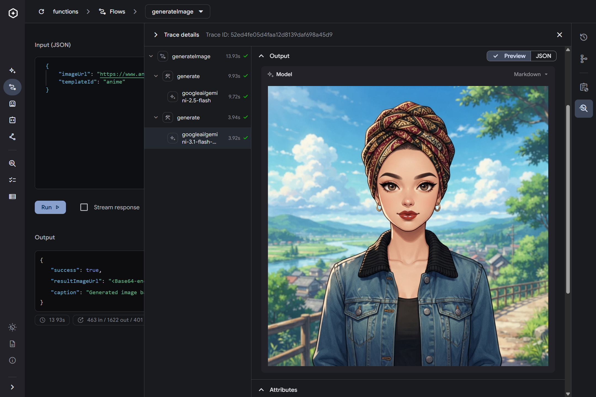
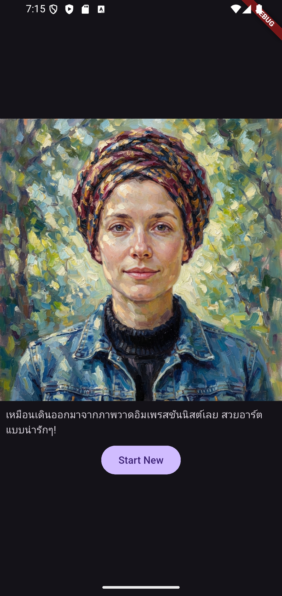
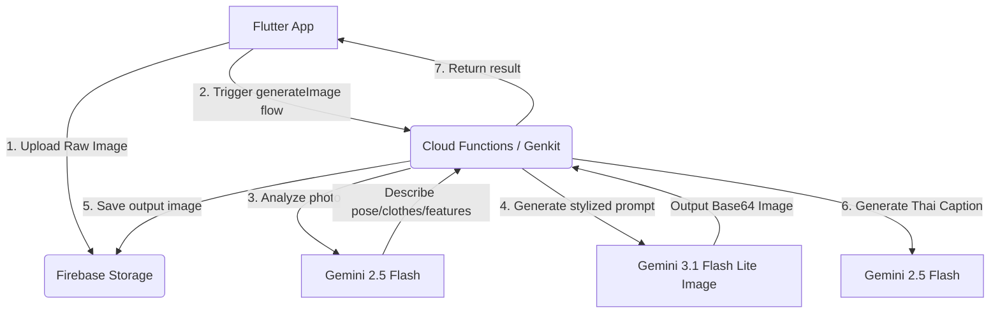

# 📸 AI Photo Booth

An interactive and intelligent AI-powered photo styling booth. This hybrid application captures or accepts an image, analyzes its content, re-imagines it in one of many premium artistic themes using **Gemini**, and generates a funny, contextual caption in Thai.

The project is divided into two primary parts:

1. **Frontend (`app/`)**: A Flutter cross-platform mobile/desktop application.
2. **Backend (`server/`)**: Firebase Cloud Functions integrated with **Firebase Genkit** and Google AI SDK.

---

## 📱 Screenshots

<p align="center">
  
  &nbsp;&nbsp;&nbsp;&nbsp;
  
</p>

---

## 🚀 Architecture & Flow



---

## 🎨 Creative Templates

The AI Photo Booth supports a rich variety of premium art styles:

| Template ID | Description & Aesthetic |
| :--- | :--- |
| `cyberpunk` | Futuristic neon-lit city street at night, glowing pink and cyan, rainy weather. |
| `fantasy` | Epic high-fantasy oil painting of a mythical hero standing on a dramatic cliff. |
| `anime` | Vibrant anime-style digital illustration with fluffy clouds (Ghibli / Makoto Shinkai style). |
| `steampunk` | 19th-century industrial laboratory with brass gears, steam pipes, sepia tones. |
| `retrowave` | 1980s synthwave neon grid landscape with giant sunset on the horizon. |
| `solarpunk` | Utopian eco-friendly city integrated with lush vertical gardens and wind turbines. |
| `dieselpunk` | Gritty mid-20th-century industrial cityscape, heavy steel, and massive machinery. |
| `vaporwave` | Surreal 1990s desktop computer environment, marble Greek statues, checkerboard floors. |
| `kawaii-pop` | Extremely cute, hyper-simplified anime style, oversized sparkling eyes, pastel rainbow. |
| `low-poly` | Sharp geometric faceted polygons, minimalist structures, modern indie game aesthetic. |
| `flat-illustration`| Modern minimalist corporate art style, bold geometric shapes, clean vector lines. |
| `impressionism` | Thick visible brushstrokes, Claude Monet style with accurate depiction of changing light. |
| `baroque` | Intense chiaroscuro contrast between deep shadows and brilliant highlights (Rembrandt style). |
| `watercolor` | Soft bleeding paint edges, translucent wet-on-wet pigments, cold press paper texture. |

---

## 🛠️ Project Structure

```
ai_photo_booth/
├── app/                  # Flutter Client Application
│   ├── lib/              # Dart source code
│   │   ├── pages/        # App screens (home, generate, template, etc.)
│   │   └── main.dart     # App entrypoint
│   └── pubspec.yaml      # Flutter dependencies
│
└── server/               # Genkit / Firebase Backend
    ├── functions/        # Cloud Functions source
    │   ├── src/          # TypeScript Genkit flow definitions
    │   └── package.json  # Backend dependencies
    └── firebase.json     # Firebase Emulators & Services config
```

---

## 💻 Getting Started

### 1. Prerequisites

- [Flutter SDK](https://docs.flutter.dev/get-started/install) (matching version in `app/pubspec.yaml` environment)
- [Node.js](https://nodejs.org/) & `npm`
- [Firebase CLI](https://firebase.google.com/docs/cli) installed globally (`npm install -g firebase-tools`)

### 2. Setting Up the Backend

Navigate to the `server/functions` directory:

```bash
cd server/functions
npm install
```

Configure your local environment variables in a `.env` file (such as `.env.photobooth-3333a`):

```properties
GEMINI_API_KEY=your_gemini_api_key_here
```

#### Run Firebase Emulators

Go to the `server` directory and start the local emulators (including Cloud Functions and Firebase Storage):

```bash
cd server
firebase emulators:start
```

### 3. Running the Flutter App

Navigate to the `app` directory, retrieve dependencies, and launch:

```bash
cd app
flutter pub get
flutter run
```

---

## 🧪 Testing the API Locally

You can test the Cloud Function `/generateImage` locally using `curl`:

```bash
curl -X POST -H "Content-Type: application/json" \
  http://127.0.0.1:5001/photobooth-3333a/us-central1/generateImage \
  -d '{"data": { "imageUrl": "https://www.anthropics.com/portraitpro/img/page-images/homepage/v22/what-can-it-do-2B.jpg", "templateId": "cyberpunk"} }'
```

#### Expected Response Format

```json
{
  "result": {
    "success": true,
    "imageUrl": "http://127.0.0.1:9199/photobooth-3333a.firebasestorage.app/processed_images%2F1783221828739_stylized.png",
    "caption": "นี่คนหรือ AI คะเนี่ย น่ารักเกินต้านทาน!"
  }
}
```
